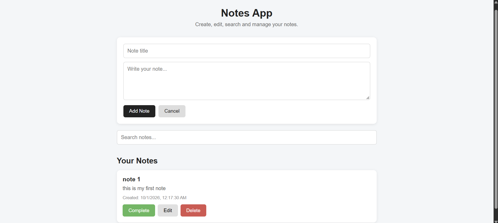

# Notes App

A simple and responsive browser-based Notes App built using **HTML, CSS, and JavaScript**. The application demonstrates practical use of **localStorage, JSON, DOM manipulation, and CRUD-style operations** without requiring a backend server or database.

## Project Preview



---

## Features

- Create new notes
- Edit existing notes
- Delete notes
- Mark notes as completed
- Search notes by title or content
- Persistent storage using `localStorage`
- JSON serialization and deserialization
- Stores note creation and update timestamps
- Responsive and clean user interface
- Runs directly in the browser with no backend setup

---

## Tech Stack

| Technology       | Purpose                                     |
| ---------------- | ------------------------------------------- |
| **HTML5**        | Application structure                       |
| **CSS3**         | Styling and responsive layout               |
| **JavaScript**   | Application logic and DOM manipulation      |
| **localStorage** | Persistent browser-side data storage        |
| **JSON**         | Storing and retrieving structured note data |

---

## Project Structure

```text
Assignment 01 - Notes App/
│
├── README.md
├── assignment01.md
├── index.html
├── style.css
├── script.js
└── screenshot.png
```

### File Description

**`index.html`**

Contains the structure of the Notes App, including:

- Note title input
- Note content textarea
- Add/Update button
- Search field
- Notes display area

**`style.css`**

Contains the application's styling, layout, buttons, note cards, completed-note styling, and responsive design.

**`script.js`**

Contains the main application logic:

- Creating notes
- Editing notes
- Deleting notes
- Completing/undoing notes
- Searching notes
- Reading from `localStorage`
- Saving data to `localStorage`
- JSON conversion

**`assignment01.md`**

Contains the assignment documentation and explanation of the implementation.

---

## Application Flow

```text
              User
                │
                ▼
        ┌───────────────┐
        │   index.html  │
        └───────┬───────┘
                │
                ▼
        ┌───────────────┐
        │  JavaScript   │
        │    Logic      │
        └───────┬───────┘
                │
                ▼
          Notes Array
                │
                ▼
        JSON.stringify()
                │
                ▼
          localStorage
                │
                ▼
          JSON.parse()
                │
                ▼
        Display Notes
```

---

## Data Storage

Each note is represented as a JavaScript object:

```javascript
{
    id: 1727694000000,
    title: "Backend Development",
    text: "Learning localStorage and JSON.",
    createdAt: "2026-10-01T10:00:00.000Z",
    updatedAt: "2026-10-01T10:00:00.000Z",
    completed: false
}
```

The collection of notes is converted into JSON before being stored:

```javascript
localStorage.setItem("notes", JSON.stringify(notes));
```

When the application starts, the stored JSON is converted back into a JavaScript array:

```javascript
const notes = JSON.parse(localStorage.getItem("notes")) || [];
```

This allows notes to remain available even after refreshing or reopening the page.

---

## How to Run

No backend server, database, or package installation is required.

### Option 1 — Open directly

Open:

```text
index.html
```

in a web browser.

### Option 2 — VS Code Live Server

Open the project in VS Code and use **Live Server** to launch `index.html`.

---

## Core Operations

### Create

The user enters a title and note content and selects **Add Note**.

### Read

Saved notes are loaded from `localStorage` and dynamically displayed on the page.

### Update

Selecting **Edit** loads the existing note into the form. The updated content is then saved with a new `updatedAt` timestamp.

### Delete

Selecting **Delete** removes the note from the notes array and updates `localStorage`.

### Search

The search field filters notes based on their title or content.

### Complete

A note can be marked as completed or changed back to an active state.

---

## Learning Outcomes

This project demonstrates practical understanding of:

- Browser `localStorage`
- JSON serialization and deserialization
- JavaScript objects and arrays
- DOM manipulation
- Event listeners
- CRUD-style operations
- Dynamic HTML generation
- Client-side data persistence
- Basic frontend application structure

---

## Assignment Context

This project was developed as part of the **Backend Development** coursework and implements the final Notes App task from the LocalStorage, SessionStorage and JSON tutorial.

The application focuses on understanding how structured JavaScript data can be converted into JSON and persisted using browser storage.

---

## Author

**Prachi Menon**

B.Tech Computer Science Engineering

UPES
